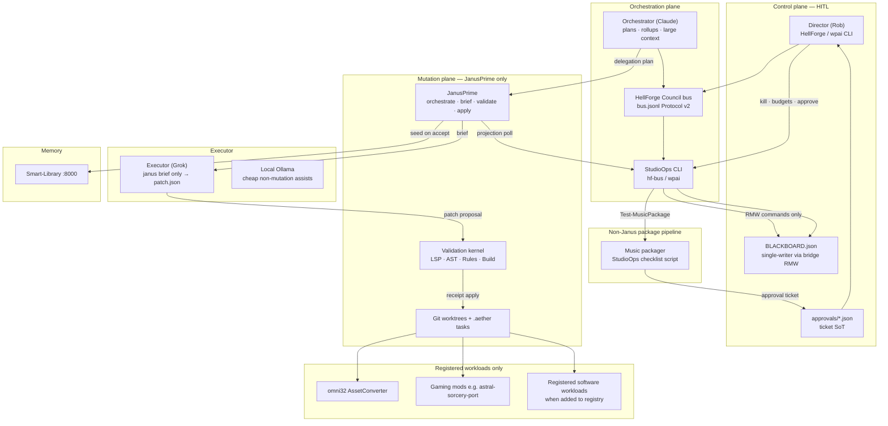
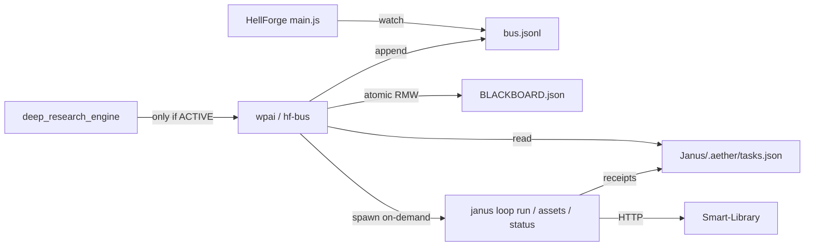
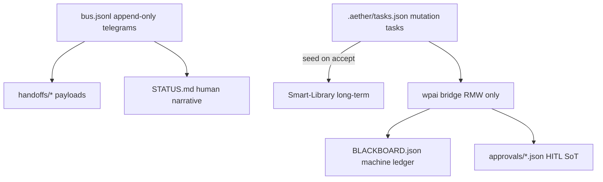
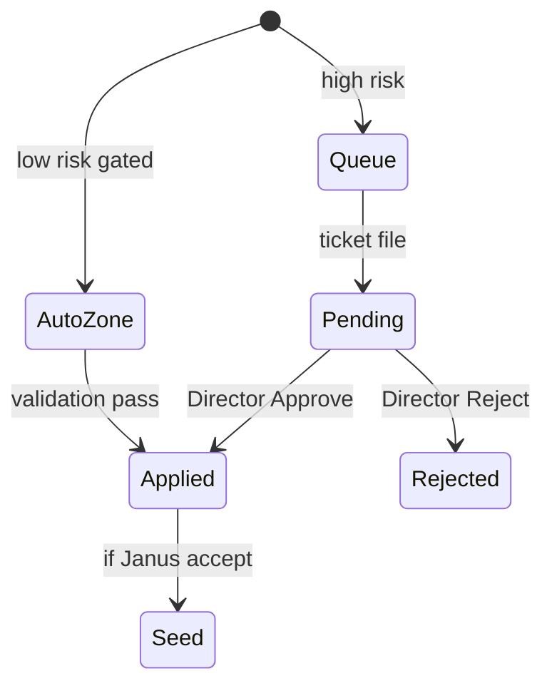

# Full Autonomous AI Architecture for WPAI Studio

| Field | Value |
|-------|--------|
| **Document** | WPAI Studio Autonomous AI Architecture |
| **Author** | Architecture (Grok Build subagent) · for Rob / Director |
| **Date** | 2026-07-11 |
| **Status** | **Complete** (2026-07-11) — PR-01–17 control plane shipped (PR-12 registry optional = skip). Music gate green. Mid-loop `--wpai-budget-gate`. No paid DistroKid/cloud required. |
| **Scope** | Unification of JanusPrime + HellForge + StudioOps + Deep Research under division-aware HITL control |
| **Audience** | Senior engineers / solo operator (Director) who know the WPAI tree |

---

## Overview

Wizard Productions AI Studio (WPAI) already runs a working multi-agent development stack (JanusPrime), an operator cockpit with a multi-agent bus (HellForge Council), a StudioOps CLI and site kit, a local self-improving research engine (deep_research_engine), and a multi-stream company plan with real revenue constraints. What it lacks is a **single control-plane architecture** that composes these systems so a solo Director can (1) run overnight gated jobs within spend budgets, (2) review morning dashboards and HITL queues, and (3) activate division agents only when roadmap funding gates fire.

This design does **not** invent a third orchestrator. It elevates HellForge + StudioOps as the **HITL control plane and blackboard surface**, JanusPrime as the **only mutation engine for code/assets**, Smart-Library as **semantic long-term memory**, and Deep Research as an **optional funded AI Research workload** behind activation and compute gates. Ambition beyond that (unbounded “AI army,” corporation-scale autonomy) is explicitly classified as **fantasy layer** and is not a system requirement.

**Business-first sequencing:** music packaging readiness (Weaponized Mind package-ready ticket) ships **before** overnight coding autonomy. Architecture wiring supports revenue time-to-value; it does not precede it.

---

## Background & Motivation

### Current state (what already works)

| System | Path | Proven capability |
|--------|------|-------------------|
| **JanusPrime** | `C:\WPAI\AI-Research\Janus` | Plan → Provision → Execute → Validate → Repair → Accept → Seed; `janus loop run`; validation kernel (LSP·AST·Rules·Build); receipts SHA-256; worktrees; Omni32 assets |
| **Project-Janus packages** | `Janus\Project-Janus\packages\` | `@aether/cli`, `orchestrator`, `task-queue`, `validation-kernel`, `shared`, `janus-integrations`, `mcp-server`, `workload-manager`, `worktree-manager` |
| **Task state** | `C:\WPAI\AI-Research\Janus\.aether\tasks.json` | Authoritative mutation task store (janus root, **not** under Project-Janus only) |
| **Smart-Library** | `Janus\Smart-Library` | Semantic `/query`, Docker heal sandbox, doctrine seed, API key on writes |
| **AssetConverter** | `C:\WPAI\AI-Research\AssetConverter` | Omni32 production pipeline (`janus.config.json` `components.assets.root: "../AssetConverter"`). Sparse tree under Janus is **not** production overnight target |
| **HellForge** | `C:\WPAI\Software\HellForge` (**has `.git`**) | Electron PTY shell; Council bus; keys stay in main process; pressure gauge; journals |
| **StudioOps / hf-bus** | `C:\WPAI\Software\StudioOps` (**no `.git` today**) | Protocol v2 CLI; site kit; not yet a versioned PR unit unless promoted |
| **Council runtime state** | `C:\WPAI\Workspace\.hellforge\` (**runtime, not a git repo**) | `bus.jsonl`, `PROTOCOL.md`, `STATUS.md`, `handoffs/`, `inbox/`, `journals/`, `exports/` |
| **Deep Research** | `C:\WPAI\AI-Research\deep_research_engine` | Genome evolution of `strategies.py` only; immutable orchestrator; Docker sandbox; canary fitness; grounding metrics |
| **Company plan** | `C:\WPAI\WPAI-ROADMAP.md`, `REVENUE-PLAN.md` | Music → Graphics → Gaming → Software → AI Research → Quantum; activation gates; AI Research spends $0 until revenue covers compute |
| **Live products** | Gumroad | RepoForge + Mixin Field Manual LIVE; music brand engine not year-1 revenue |

### VCS layout (implementation constraint)

| Tree | Git? | How “PRs” work |
|------|------|----------------|
| `C:\WPAI\AI-Research\Janus` | Yes | Real PRs / commits for bridge package, loop hooks, registry |
| `C:\WPAI\Software\HellForge` | Yes | Real PRs for Command Deck, bus typed posts, blackboard IPC |
| `C:\WPAI\Software\StudioOps` | **No** | Promote to git **or** house CLI under Janus `scripts/studioops/` / HellForge-adjacent tracked path (see Key Decision 15) |
| `C:\WPAI\Workspace` | **No** | **Runtime only** — `.wpai/`, `.hellforge/` created by installer, never “merged” as PRs |
| `C:\WPAI` root | **No** | Not a monorepo PR target |

### Pain points

1. **Siloed control planes.** Janus tasks live in `.aether/tasks.json`; Council ops live in `bus.jsonl` + `STATUS.md`; Janus also has `COMMS-CLAUDE-GROK.md` / `comms.jsonl`. Three partial boards, no studio-wide machine ledger.
2. **No division activation enforcement.** Agents can spin R&D or overnight coding without budget/roadmap gates.
3. **HITL is informal.** Approve/reject for publishes, DistroKid, doctrine, spend is not a durable ticket queue.
4. **Validation is code/asset-centric.** Music packaging remains human checklist without machine gate — and it is the **near-term brand bottleneck**.
5. **Token/spend burn risk.** Overnight loops without mid-loop spend accounting can exceed daily/monthly caps after a single preflight.
6. **Dual Janus lineages risk.** Global `janus` npm shim vs `scripts/janus.ps1` vs stale paths.

### Why now

RepoForge and MFM are live; **music packaging is the near-term brand bottleneck** (Weaponized Mind freeze already largely complete under `Music/Releases/Weaponized Mind/`); JanusPrime Phase 3 loop exists; HellForge Protocol v2 just landed. Next step is **wiring + music package-ready tickets first**, then budgeted overnight coding — not architecture theater before DistroKid readiness.

---

## Goals & Non-Goals

### Goals

1. **Single control plane hierarchy:** Director (HITL) → Orchestrator (Claude) → Janus-mediated executors → workloads.
2. **Compose existing systems** via adapters (studio-bridge + BLACKBOARD), not parallel silos.
3. **Studio BLACKBOARD** as structured status ledger with atomic writes and single-writer semantics.
4. **Division-aware allowed-actions** encoded as a pure preflight function + Director override checklist.
5. **Budgeted autonomous loops** with **preflight and mid-loop** spend/invocation caps and kill switches.
6. **HITL approval matrix** with complete ticket schema and bus notifications (ticket file = source of truth).
7. **Sandbox security model** extending Smart-Library Docker + Deep Research patterns.
8. **Observability** prioritized for Phase 1 morning review (not full chrome day one).
9. **Phased build** aligned to revenue reality (music package-ready before overnight coding autonomy).
10. **Incremental implementation units** mapped to **real git repos** + **runtime bootstrap**, not fictional Workspace PRs.

### Non-Goals

- Building a multi-tenant cloud orchestration product or Kubernetes ops platform.
- Replacing Janus validation kernel or inventing a second patch gate / second task store.
- Full Theia IDE (Janus Phase 4 deferred).
- Unbounded “24/7 AI army” as a requirement.
- Selling Minecraft mods; Gaming is quality + audience funnel only.
- Auto-spending money without HITL.
- Quantum division runtime.
- Automatic revenue scraping from Gumroad/DistroKid in Phases 0–3.
- Freeform bus `type:task` chat auto-creating Janus tasks.

### Fantasy vs buildable (honest scope)

| Layer | Classification | Stance |
|-------|----------------|--------|
| Music package checklist + approval ticket | **Buildable now** | Phase 0–1 (priority) |
| Overnight Janus loops with mid-loop caps | **Buildable** | Phase 2–3 after arming contract |
| HellForge morning HITL board (minimal panels) | **Buildable now** | Phase 1 |
| Division activation as Director checklist + preflight table | **Buildable** | Phase 1 |
| Deep Research night swarm | **Buildable when funded** | Phase 4 |
| Self-writing company strategy / unbounded agent mesh | **Fantasy** | Not designed |
| Fully unsupervised public product publish | **Dangerous** | Always HITL |

**PR acceptance criterion (binding for every implementation unit):** does not introduce a second task store or unsupervised publish path.

---

## Proposed Design

### 1. Control plane hierarchy



**Invariant (binding):** Only JanusPrime may mutate **registered workload repos** (validation receipt required). HellForge is the seat and bus, not a second write path. The Executor never writes workload trees directly — it produces `patch.json` / asset task outcomes consumed by the gate. Music packaging is a **StudioOps checklist process** (read catalog/release folders; write reports under `.wpai/`), not Grok freeform FS mutation.

**Role model:**

| Role | Human/agent | Context budget | Authority |
|------|-------------|----------------|-----------|
| **director** | Rob (HITL) | Full studio | Money, public publish, doctrine, activation overrides, kill switches, overnight arm |
| **orchestrator** | Claude | Large | Plan, task create, review, abandon/retry; no ungated workload mutation |
| **executor** | Grok | Minimal (`janus brief`) | Patches only via validation gate; assets via `janus assets *` |
| **local** | Ollama | Small | Offline/cheap non-critical assists |
| **shell** | PTY | N/A | Operator commands |
| **bridge** | `wpai` CLI process (on-demand) | N/A | BLACKBOARD RMW, preflight, overnight spawn, projections — not an LLM |

### 2. How systems compose (integration seams)



| Seam | Mechanism | Owner |
|------|-----------|-------|
| **Council ↔ StudioOps** | Live: `HFCouncil` + `hf-bus.ps1` Protocol v2 | HellForge + StudioOps sources |
| **Council ↔ Janus** | On-demand `wpai` bridge commands; **only structured Janus job handoffs** create plans | Versioned CLI + optional `@janus/studio-bridge` |
| **Janus ↔ BLACKBOARD** | Projection after status poll / loop exit (polling Phase 0–1) | bridge |
| **Janus ↔ Memory** | Existing clients + seed policy | Keep |
| **Janus ↔ Assets** | `AssetTaskExecutor`; production root `C:\WPAI\AI-Research\AssetConverter` | Keep; pin resolved path in config |
| **Janus internal comms** | Deprecate studio use of `COMMS-CLAUDE-GROK.md` gradually | Docs + optional mirror |
| **Deep Research** | Separate process under division gate | Not in Janus kernel |
| **HellForge keys** | Main process only | Preserve |

#### 2.1 Janus job handoff schema (bus `type:task` / `handoff` → Janus)

**Non-goal:** freeform chat `type:task` messages do **not** create Janus tasks.

**Critical:** A `janus_job` handoff is a **studio intent document**, not a valid `DelegationPlan`. Live schema in `Project-Janus/packages/orchestrator/src/plan.ts` (`DelegationPlanSchema`) requires:

| Plan field | Constraint |
|------------|------------|
| `parent` | `assignee` **literal `"claude"`**; nested `spec` + `validation_profile` |
| `children` | **min 1**; each `assignee` **literal `"grok"`**; nested `task` (`CreateTaskInput` without `parent_id`); `patch_mode`: `"identity"` \| `"manual"` (default `"identity"`) |
| `provision` | optional; defaults `{ auto_worktree: true, auto_prepare: false }` |

Passing flat `janus_job` JSON to `aether orchestrate plan -f` will **fail Zod parse**. Bridge **must transform** job → plan.

Only handoffs whose payload validates as a **Janus Job** are actionable:

**File:** `.hellforge/handoffs/<id>-janus-job.json` (or markdown with YAML front-matter equivalent)

```json
{
  "schema_version": "1.0.0",
  "kind": "janus_job",
  "workload": "nodecore",
  "validation_profile": "forge-mod-v1",
  "objective": "Fix LSP warnings in NodeAdlodsSyncHandler",
  "files_in_scope": ["src/main/java/.../NodeAdlodsSyncHandler.java"],
  "constraints": ["no SuppressWarnings", "zero warnings"],
  "acceptance_criteria": ["gradle build clean", "validation receipt"],
  "patch_mode": "manual",
  "parent_task_id": null,
  "context_refs": ["doc:claude", "division:gaming"]
}
```

| Field | Required | Notes |
|-------|----------|-------|
| `kind` | yes | must be `janus_job` |
| `workload` | yes | must exist in `workloads/registry.json` |
| `objective` | yes | becomes **child** `task.spec.objective` |
| `files_in_scope` | yes for code patches | empty only for pure asset-marker tasks with `context_refs`; goes on **child** `task.spec` |
| `validation_profile` | yes | explicit on both parent and child; never silent registry default |
| `patch_mode` | no | default **`manual`** for code patches (executor produces patch); use `identity` only when identity-retrofit is intended |
| `parent_task_id` | no | if set and exists in `.aether`, **do not** create a new plan — run/attach that parent only |
| `assignee` | **omit / ignored** | job-level assignee is not a plan field; parent is always Claude, child always Grok per `DelegationPlanSchema` |
| `context_refs` | no | copied to parent + child (CLI also auto-injects `doc:claude`) |
| `constraints` / `acceptance_criteria` | no | copied to **child** `task.spec`; parent gets coordinator acceptance |

**Normative transform** `janus_job` → `DelegationPlan` (single-child only in Phases 0–3; multi-child jobs out of scope unless schema extended):

```json
{
  "parent": {
    "assignee": "claude",
    "workload": null,
    "validation_profile": "<job.validation_profile>",
    "context_refs": ["doc:claude", "…job.context_refs"],
    "spec": {
      "objective": "Coordinate: <job.objective>",
      "constraints": ["Studio bridge created plan from janus_job", "…optional job.constraints"],
      "files_in_scope": [],
      "acceptance_criteria": ["All children accepted"]
    }
  },
  "children": [
    {
      "assignee": "grok",
      "patch_mode": "<job.patch_mode || \"manual\">",
      "task": {
        "workload": "<job.workload>",
        "validation_profile": "<job.validation_profile>",
        "context_refs": ["doc:claude", "…job.context_refs"],
        "spec": {
          "objective": "<job.objective>",
          "constraints": "<job.constraints || []>",
          "files_in_scope": "<job.files_in_scope>",
          "acceptance_criteria": "<job.acceptance_criteria || []>"
        }
      }
    }
  ],
  "provision": { "auto_worktree": true, "auto_prepare": false }
}
```

| Job field | Maps to |
|-----------|---------|
| `objective` | child `task.spec.objective`; parent objective = `"Coordinate: " + objective` |
| `files_in_scope` | child `task.spec.files_in_scope` only (parent `[]`) |
| `workload` | child `task.workload` (parent usually `null` unless Director wants parent bound) |
| `validation_profile` | parent **and** child `validation_profile` |
| `patch_mode` | child `patch_mode` (`manual` default for code) |
| `constraints` / `acceptance_criteria` | child `task.spec`; parent acceptance fixed to rollup |
| — | parent `assignee` forced `"claude"`; child `assignee` forced `"grok"` |

**Bridge handling:**

1. Validate JSON against `janus_job` schema; on failure → bus `block` + do not call Janus.
2. If `parent_task_id` present and exists in `.aether` → use it (no new plan); optional future: add children only via explicit extend API (out of scope Phase 0–3).
3. Else **transform** to `DelegationPlan` per table above; write plan JSON under `.wpai/plans/<id>-delegation.json`; invoke pinned CLI with **cwd = `janus_root`** (or ensure `findRepoRoot` resolves `janus.config.json` under pinned root):  
   `node …/cli/dist/bin.js orchestrate plan -f <delegation.json>`  
   Do **not** pass raw `janus_job` to `-f`.
4. On Zod/CLI failure → bus `block` with error summary; leave no half-applied plan if CLI is atomic (if partial tasks exist, document repair via `orchestrate status`).
5. Bus `ack` with new **parent** task id in short `text` and `path` to the written DelegationPlan file.
6. Lane locks (PROTOCOL.md): do not start if STATUS.md marks another agent locking the same paths without Director override — bridge reads STATUS lock section if present; otherwise proceeds with Janus worktree isolation only.

#### 2.2 studio-bridge process model (resolved)

| Decision | Phase 0–3 choice |
|----------|------------------|
| **Process model** | **On-demand CLI only** — `wpai bridge sync`, `wpai overnight start`, `wpai music check`. No always-on Windows service, no long-lived daemon |
| **Package** | Prefer `@janus/studio-bridge` (Janus monorepo) for task-queue types + thin PowerShell wrappers in StudioOps source tree for Director UX. Bridge is **Janus-facing**, not `@aether/*` core; depends on `@aether/task-queue` / `@janus/integrations` as needed; **must not** depend on Electron/HellForge |
| **Discovery** | Paths pinned in `C:\WPAI\Workspace\.wpai\config.json` (see §10) |
| **HellForge closed** | Overnight via Task Scheduler → `wpai overnight start`; bridge not required for interactive Council |
| **Polling** | Phase 0–1: poll `.aether/tasks.json` every **30s** while overnight process runs; exit when loop process exits. PR post-loop hook is optional optimization, not required for overnight |

**Pinned paths in config (defaults):**

```json
{
  "janus_root": "C:\\WPAI\\AI-Research\\Janus",
  "aether_tasks_path": "C:\\WPAI\\AI-Research\\Janus\\.aether\\tasks.json",
  "janus_cli": "node C:\\WPAI\\AI-Research\\Janus\\Project-Janus\\packages\\cli\\dist\\bin.js",
  "assets_root": "C:\\WPAI\\AI-Research\\AssetConverter",
  "music_root": "C:\\WPAI\\Music",
  "music_release_next": "Weaponized Mind",
  "hellforge_dir": "C:\\WPAI\\Workspace\\.hellforge",
  "blackboard_path": "C:\\WPAI\\Workspace\\.wpai\\BLACKBOARD.json"
}
```

| Path key | Purpose |
|----------|---------|
| `music_root` | Absolute catalog root (`CATALOG.md`, `Releases/`, `Tracks/`) — avoids CWD footguns under Task Scheduler / `wpai music check` |
| `music_release_next` | Default release folder name under `music_root\Releases\` for checklist |

Bridge refuses to run if `janus.config.json` is not found under `janus_root`.

### 3. Shared memory / blackboard protocol

Three stores with different write rates — do not collapse them.



#### 3.1 BLACKBOARD write protocol (atomic, single logical writer)

**Path:** `C:\WPAI\Workspace\.wpai\BLACKBOARD.json`

**Mandatory protocol (blocking for multi-process safety):**

1. **Single logical writer:** only `wpai` / `@janus/studio-bridge` RMW helpers mutate BLACKBOARD. HellForge UI and Director never `JSON.stringify` overwrite the file ad-hoc — they call `wpai board set-kill`, `wpai budget set`, `wpai approve`, etc., which perform RMW.
2. **Atomic RMW:** read → apply pure function → write to `BLACKBOARD.json.tmp.<pid>` → `fs.rename` over target (same pattern as `@aether/task-queue` temp+rename). On Windows, rename-replace is the atomicity boundary.
3. **Optimistic concurrency:** every document has `generation: number` (monotone). Writer fails and retries (max 5) if on-disk `generation` ≠ expected. Bump `generation` and `updated_at` on every successful write.
4. **Field ownership matrix:**

| Top-level key | Owner (only writer of field content) | Others |
|---------------|--------------------------------------|--------|
| `kill_switch` | Director via `wpai` / HellForge→wpai | Bridge reads for preflight; never clears Director `true` without explicit Director command |
| `budgets` caps (`api_usd_cap_day`, `api_usd_cap_month`, max rounds, max invocations) | Director | Bridge updates only `*_spent_est` / counters |
| `budgets.*_spent_est`, `executor_invocations` | Bridge overnight/sync | |
| `director_goal` | Director | |
| `divisions.*.state` overrides + research evidence fields | Director | Bridge may update `queue_depth`, `last_event` only |
| `janus` projection | Bridge | |
| `overnight` | Director arms; Bridge clears/completes status | |
| `pipelines` | Bridge + domain scripts **via RMW only** (not ad-hoc script overwrites) | |
| `approvals_pending` | Bridge (ids only; tickets live in files) | |
| `events[]` | Bridge append-only via RMW (ring cap 200) | Never wholesale replace from UI |
| `generation` / `updated_at` | Bridge RMW layer | |

5. **Integration test requirement:** concurrent kill toggle + projection refresh must not drop kill or lose generation monotonicity.

6. **Split-brain severity:** concurrent lost updates on kill/spend are **High** risk if protocol is ignored — implementation must treat single-writer RMW as non-optional.

#### 3.2 BLACKBOARD schema

```json
{
  "schema_version": "1.0.0",
  "generation": 1,
  "updated_at": "2026-07-11T12:00:00Z",
  "director_goal": "string",
  "kill_switch": {
    "global": false,
    "loops": false,
    "research": false,
    "publishes": false
  },
  "budgets": {
    "period_day": "2026-07-11",
    "period_month": "2026-07",
    "api_usd_cap_day": 5.0,
    "api_usd_cap_month": 40.0,
    "api_usd_spent_est_day": 0.0,
    "api_usd_spent_est_month": 0.0,
    "max_overnight_rounds": 10,
    "max_executor_invocations_day": 30,
    "executor_invocations_day": 0,
    "max_parallel_workloads": 1,
    "cost_model_version": "v0"
  },
  "overnight": {
    "armed": false,
    "parent_task_ids": [],
    "max_rounds": 10,
    "armed_by": null,
    "armed_at": null,
    "expires_at": null,
    "last_run": null
  },
  "divisions": {
    "music": { "state": "active", "queue_depth": 0, "last_event": null },
    "graphics": { "state": "support", "queue_depth": 0, "last_event": null },
    "gaming": { "state": "active_external", "queue_depth": 0, "last_event": null },
    "software": { "state": "internal", "queue_depth": 0, "last_event": null },
    "ai_research": {
      "state": "dormant",
      "activation": "director_checklist",
      "compute_budget_usd_month": 0,
      "revenue_covers_compute": false,
      "activated_by": null,
      "activated_at": null,
      "queue_depth": 0
    },
    "quantum": { "state": "dormant", "activation": "post_research" }
  },
  "janus": {
    "cli_path": "…",
    "parents": [],
    "open_tasks": 0,
    "failed_tasks": 0,
    "last_loop": null
  },
  "pipelines": {
    "music_release": { "next": "Weaponized Mind", "checklist_pass": false, "hitl_required": true },
    "omni32": { "queue_depth": 0, "last_mod": null, "assets_root": "C:\\WPAI\\AI-Research\\AssetConverter" },
    "software_storefront": { "repoforge": "live", "mfm": "live" },
    "revenue": { "notes": "manual; no auto-scrape Phases 0–3" }
  },
  "approvals_pending": [],
  "events": []
}
```

#### 3.3 BlackboardEvent schema (for 3× promotion and audit)

```json
{
  "ts": "2026-07-11T12:00:00Z",
  "kind": "manual_step | pipeline | overnight | approval | kill | budget | promotion_candidate",
  "step_key": "music.package_checklist.manual",
  "division": "music",
  "actor": "director | orchestrator | executor | bridge | local",
  "refs": { "path": null, "task_id": null, "approval_id": null }
}
```

**Initial `step_key` taxonomy:**

| step_key | Meaning |
|----------|---------|
| `music.package_checklist.manual` | Human filled package checklist |
| `music.package_checklist.auto` | Script checklist run |
| `music.distrokid_upload.manual` | Human DistroKid upload completed |
| `graphics.cover_compose.manual` | Manual cover work |
| `software.site_pack.manual` | Manual Pack-Site |
| `software.gumroad_listing.manual` | Manual listing edit |
| `janus.loop.complete` | Overnight/parent loop finished |
| `janus.loop.aborted_budget` | Stopped on spend/invocation cap |

**3× promotion rule:** count events with same `step_key` and `kind: manual_step` in a **rolling 90-day** window. When count ≥ 3, bridge appends `kind: promotion_candidate` and posts bus `task` to orchestrator: propose Software automation. **Only Director-ack’d** bus tasks authorize actual build work (never auto-implement).

#### 3.4 Consistency with Protocol v2

- Bus remains short control. **Align implementation:** `hf-bus.ps1` currently truncates non-chat at **500** chars; PROTOCOL says **~400**. PR-02 sets truncate to **400** for non-chat to match PROTOCOL (chat may remain longer but discouraged).
- New types: `approve_request`, `approve_result`, `budget`, `kill`, `blackboard_sync` — `text` short; `path` points at ticket/handoff.
- `STATUS.md` remains human narrative; BLACKBOARD is machine-authoritative for gates.
- `.aether/tasks.json` remains task truth for code/assets; BLACKBOARD `janus.*` is projection only.
- Smart-Library remains long-term semantic memory; seed only on accept/heal.

### 4. Division agents and activation algorithm

Division agents are permissioned tool surfaces, not always-on processes.

#### 4.1 Activation as pure preflight (not auto-revenue scrape)

```
allowed_actions(division, blackboard, config) → Action[]
```

Phases 0–3: **no automatic revenue scrape**. AI Research enable path is **Director-only checklist**:

| Field | Set by | Meaning |
|-------|--------|---------|
| `divisions.ai_research.revenue_covers_compute` | Director only | Explicit boolean attestation |
| `divisions.ai_research.compute_budget_usd_month` | Director only | e.g. 20 means max $20/mo local/cloud for research |
| `divisions.ai_research.state` | Director via `wpai division activate ai_research` | Requires both fields valid (`revenue_covers_compute == true` and budget > 0) |

#### 4.2 Forbidden / allowed actions by state

| Division state | Allowed | Forbidden |
|----------------|---------|-----------|
| `active` (music) | package checklist, draft listings under `.wpai/drafts/`, Janus tasks for tooling that supports music | auto DistroKid/Bandcamp/YouTube publish |
| `support` (graphics) | draft art under `.wpai/drafts/graphics/`, Janus asset tasks for Omni32 | public brand kit deploy without approval |
| `active_external` (gaming) | Janus code on registered gaming workloads | sell mods; public listing copy without approval |
| `internal` (software) | Janus on **registered** software workloads only; site pack scripts with HITL deploy | invent unregistered product trees as Janus workloads without registry PR |
| `dormant` (ai_research, quantum) | status read only | any research loop, genome promote, spend |

#### 4.3 Agent table

| Agent | Division | Tools | Auto-allowed | HITL-required |
|-------|----------|-------|--------------|---------------|
| **Music Director** | Music active | Catalog/`Music/**` **read**; checklist script; drafts `.wpai/drafts/music/` | Package prep + checklist validation | DistroKid/Bandcamp/YouTube publish |
| **Creative Assets** | Graphics support | Janus assets; Brand read; drafts `.wpai/drafts/graphics/` | Omni32 audit/upscale under budget | Public pack deploy |
| **SysAdmin / Code** | Cross-cutting | Full Janus on **registered** workloads | Loop when overnight armed + budgets | Doctrine, new registry entries, credentials |
| **Gaming Lead** | Gaming | Registered mod workloads | Code/fix via Janus | Public listing narrative; never sell mods |
| **Software Lead** | Software internal | Registered workloads + StudioOps scripts | Tests/builds in worktrees | Gumroad/site deploy; new product auth |
| **R&D Night Swarm** | AI Research dormant | deep_research Docker | None while dormant | Activate + budget + `research_enable` ticket |

**Draft write roots (non-Janus):** only under `C:\WPAI\Workspace\.wpai\drafts\<division>\`. Never write release masters, DistroKid, or workload repos from draft tools.

**Workload registry truth:** `astral-sorcery-port` **is** registered. **`hellforge` and `studioops` are NOT registered today.** Overnight/Janus mutation of HellForge or StudioOps source requires an explicit registry PR (validation profiles `typescript-v1` / script policy) **or** remains human/HellForge-PTY-only (default non-goal for Janus overnight until registered).

### 5. Autonomous loops with budgets

#### 5.0 Shared preflight + mid-loop budget contract

```
function mayContinue(bb, projected_next_cost_usd, next_invocations=1):
  if bb.kill_switch.global or bb.kill_switch.loops: return ABORT
  if bb.budgets.api_usd_spent_est_day + projected_next_cost_usd > bb.budgets.api_usd_cap_day: return ABORT
  if bb.budgets.api_usd_spent_est_month + projected_next_cost_usd > bb.budgets.api_usd_cap_month: return ABORT
  if bb.budgets.executor_invocations_day + next_invocations > bb.budgets.max_executor_invocations_day: return ABORT
  return OK
```

**Cost model v0 (mandatory, conservative ceilings — not billing):**

**Additive rule (normative):**  
`round_cost_usd = ROUND_FEE + (EXECUTOR_FEE × executor_invocations_in_round) + (PLAN_FEE if plan authored this step else 0)`  

Fees are **not** inclusive of each other. A round with two Grok children costs **`$1.00 + 2×$0.50 = $2.00`**, not $1.00.

| Event | Estimated USD (v0) | Who records |
|-------|-------------------|-------------|
| Overnight preflight / bridge sync (no LLM) | $0.00 | — |
| Orchestrator plan authoring session (if invoked) | $1.50 (`PLAN_FEE`) | bridge when plan created overnight |
| Janus loop **round fee** (any round that executes ≥1 active child) | $1.00 (`ROUND_FEE`) | overnight runner after each round |
| Per **executor invocation** (Grok brief→patch / ManualPatchExecutor / HellForge `api:ask` executor) | $0.50 (`EXECUTOR_FEE`) | runner / HellForge optional meter |
| Local Ollama call | $0.00 | — |
| Omni32 host Python upscale (no cloud LLM) | $0.00 | — |
| Music checklist script | $0.00 | — |

**Worked example:** one overnight round runs two manual children successfully → charge `$1.00 + $0.50 + $0.50 = $2.00` to day and month spent estimates; increment `executor_invocations_day` by **2**.

Constants live in `.wpai/config.json` under `cost_model_v0` so Director can tune without code change. Estimates intentionally **high** to stop early.

**Hard non-USD cap:** `max_executor_invocations_day` (default **30**) — independent of USD; prevents “cheap model” burn loops.

**Instrumentation points:**

| Point | Mechanism |
|-------|-----------|
| Overnight runner wrapping `janus loop run` | Prefer **round-sliced control**: runner invokes loop with `--max-rounds 1` repeatedly (or adds budget callback in `@janus/integrations` when PR lands). After each round: RMW spend += cost_model round + count executor children executed; if `mayContinue` fails → stop, bus `block`/`status`, do **not** start next round |
| Existing single `janus loop run --max-rounds 10` | **Insufficient alone** for mid-loop spend — **PR-08** (overnight runner) **must not** claim USD enforcement via a single preflight before multi-round `loop run`. Either round-slice (`--max-rounds 1` loop) or land **PR-09** per-round hook **before** claiming enforceable USD caps. (PR-07 is Janus job→plan only; it does not ship spend caps.) |
| HellForge `api:ask` | Optional: increment day spend via `wpai budget add-est` (Phase 1+) |
| ManualPatchExecutor / Qwen executor | Future: emit counter file under `.wpai/meters/` read by bridge |

**Period rollover:** on `period_day` / `period_month` change, bridge zeros day counters; month counters zero on month change.

#### 5.1 Overnight coding loop — arming contract

**Existing loop code:** `JanusAutonomousLoop` — `max_rounds` default = `self_repair.max_validation_retries` (5). CLI **requires** `-t/--task`; there is no “run whatever is pending.”

**Overnight Plan artifact** (authoritative arm state — also mirrored on BLACKBOARD `overnight`):

**Path:** `C:\WPAI\Workspace\.wpai\overnight-plan.json`

```json
{
  "schema_version": "1.0.0",
  "armed": true,
  "parent_task_ids": ["task-abc…"],
  "max_rounds": 10,
  "armed_by": "director",
  "armed_at": "2026-07-11T22:00:00Z",
  "expires_at": "2026-07-12T12:00:00Z",
  "approval_id": "appr-…",
  "notes": "NodeCore LSP cleanup parent only"
}
```

**Flow:**

1. **Orchestrator** creates Janus parent(s) via `orchestrate plan` (interactive daytime) — parent ids known.
2. **Director** arms: `wpai overnight arm --parent task-abc --max-rounds 10 --expires 12h` (writes overnight-plan + BLACKBOARD RMW; optional approval ticket `kind: overnight_arm`).
3. **Scheduler / Director** runs `wpai overnight start` which:
   - preflight kill + budgets + `overnight.armed` + `expires_at` not past + lockfile
   - runs **only** listed `parent_task_ids` **sequentially**
   - mid-loop budget checks per §5.0
   - on completion/abort: write `.wpai/logs/overnight-*.jsonl`, bus status, set `armed: false` (require re-arm next night)
4. **Parallel parents:** **`max_parallel_workloads: 1`** (resolved). Sequential only. Schema default is 1; do not run two parents concurrently on solo hardware without Director raising the cap **and** future multi-process design.

**Kill:** `kill_switch.loops` or delete `.wpai/OVERNIGHT.lock` / `wpai overnight stop`.

#### 5.2 Asset queue loop (Omni32)

Budgeted N mods/night; pin `assets_root` from config (production AssetConverter, **not** sparse); no `--deploy` without approval ticket `kind: pack_deploy`.

#### 5.3 Music packaging loop (priority pipeline)

Machine steps only:

1. Resolve paths from config: `music_root` (default `C:\WPAI\Music`), release = `Join-Path music_root "Releases\$music_release_next"` (or `-Release` override). Read `CATALOG.md` under `music_root`.
2. Run checklist gate (`Test-MusicPackage` / music-package-v1): WAV, cover 3000×3000, `meta.txt` human-contribution, AI disclosure draft, Explicit flag.
3. Write report under `.wpai/drafts/music/` + approval ticket file `kind: music_publish` under `.wpai/approvals/`.
4. **Stop.** Director uploads DistroKid/Bandcamp/YouTube.

Does **not** require overnight Janus loop or full bridge daemon.

**PR-03 BLACKBOARD rule (normative):** music check **writes only** ticket files + draft reports. It must **not** open or rewrite `BLACKBOARD.json` (`approvals_pending`, `pipelines.music_release`, `events[]`) until PR-04 RMW exists. `wpai approve list` / early status scan the **approvals directory** (and optionally BB after PR-04 syncs ids).

#### 5.4 Research genome loop (gated)

Only if `divisions.ai_research.state == active` and `kill_switch.research == false` and checklist fields valid.

- Default `META_GENERATIONS` ≤ 5; wall-clock 4h.
- **`META_GENERATIONS=0` (forever) denied by default.** Override only via HITL approval ticket `kind: research_enable` with body field `allow_forever: true` **and** config flag `research.allow_forever=true`. **No cryptographic “signing”** — ticket + config attestation is sufficient.
- No paid cloud LLM unless `compute_budget_usd_month` covers it (Director-set).

#### 5.5 Spend model vs REVENUE-PLAN

REVENUE-PLAN envelope ~**$0–50/month**. Defaults:

| Cap | Default | Rationale |
|-----|---------|-----------|
| `api_usd_cap_day` | **$5** | Avoid multi-night burn of monthly envelope |
| `api_usd_cap_month` | **$40** | Under ~$50 plan with headroom for DistroKid/year amortize |
| Overnight “extra” | counted inside day/month | Not a separate unlimited bucket |

Director may raise caps via HITL after two weeks of estimate data.

### 6. HITL approval gates



| Action | Auto if gated | Needs Approve |
|--------|---------------|---------------|
| Janus patch apply after validation (armed overnight parent) | ✓ | New parent/product repo plans |
| Memory seed on accept/heal | ✓ | Unexpected doctrine hash reseed |
| Omni32 upscale to output/ | ✓ | pack_deploy |
| Music package checklist pass | ✓ prep | music_publish (DistroKid etc.) |
| Gumroad listing/price | — | storefront_change |
| Public site deploy | — | site_deploy |
| Software tool from 3× promotion | plan draft | software_build_auth |
| Activate AI Research | — | research_enable |
| META_GENERATIONS forever | — | research_enable + allow_forever |
| Doctrine change | — | doctrine_change |
| Spend cap raise | — | spend_cap |
| Kill switch clear | — | Director command |
| Overnight arm | — | overnight_arm (or CLI as Director session) |
| Agent spend money (ads) | never | spend_money |
| Git push public release | — | git_public_push |

#### 6.1 Approval ticket schema (complete)

**Path:** `C:\WPAI\Workspace\.wpai\approvals\<id>.json`  
**Source of truth for decision:** ticket file first; bus is notification only.

```json
{
  "schema_version": "1.0.0",
  "id": "appr-8f3a2c01",
  "created_at": "2026-07-11T08:00:00Z",
  "requested_by": "bridge | orchestrator | director | music-check",
  "division": "music",
  "kind": "music_publish",
  "summary": "Weaponized Mind ready for DistroKid",
  "path": "C:\\WPAI\\Workspace\\.wpai\\drafts\\music\\weaponized-mind-report.md",
  "handoff_sha256": "…",
  "path_mtime": "2026-07-11T07:55:00Z",
  "parent_task_id": null,
  "risk": "high",
  "status": "pending",
  "expires_at": "2026-07-18T08:00:00Z",
  "decided_by": null,
  "decided_at": null,
  "deny_reason": null,
  "decision_generation": 0,
  "allow_forever": false,
  "audit": []
}
```

**Idempotent decision:** `wpai approve ok|no` loads ticket; if `status != pending`, no-op success with message; on decide, set status, `decision_generation++`, append `audit[]` entry; refuse double-approve.

**`kind` enum (maps matrix):**  
`music_publish | pack_deploy | site_deploy | storefront_change | doctrine_change | research_enable | spend_cap | spend_money | overnight_arm | software_build_auth | git_public_push | generic`

#### 6.2 HellForge bus typing for approvals

Today `HFCouncil.makeMessage` emits only `{ts,from,to,text}`. Protocol v2 and `hf-bus.ps1` support `type`/`id`/`path`/`ref`.

**Requirement:** HellForge paths that post typed events must **not** strip fields. `council:post` already accepts free objects — use full Protocol v2 payloads for `approve_request` / `approve_result`. Reserve `makeMessage` for simple chat only.

Flow: write/update ticket file → append bus line with `type`, `id`, `path`, short `text`.

### 7. VENV / sandbox security model

| Layer | Mechanism |
|-------|-----------|
| Patch gate | No disk without validation receipt |
| Python heal | Docker; `SANDBOX_FAIL_CLOSED=true` recommended overnight |
| Research | Docker + static genome scan; host never runs candidate research code |
| Keys | Electron main / env; never in briefs or bus |
| Worktrees | Per child task |
| Overnight lock | `.wpai/OVERNIGHT.lock` single instance |
| IP | Local-first Smart-Library; no cloud dump of masters |

### 8. Observability dashboard requirements

**Phase 1 must-have panels only** (HellForge Command Deck / `wpai status`):

1. **Approvals** pending count + list  
2. **Kill / Budget** (day+month spent vs cap, invocation count)  
3. **Overnight last run** (armed?, last result, abort reason)  
4. **Bus tail** (existing Council)

**Defer to Phase 2+:** asset queue chrome, research gen/fitness, revenue pipeline panel, full division matrix UI (CLI `wpai board` can still print full BLACKBOARD).

Morning checklist ≤10 items remains binding. Logging: bus exports, journals, receipts, `.wpai/logs/`; no secrets.

### 9. Phased build plan (roadmap + revenue aligned)

| Phase | Name | Exit criteria |
|-------|------|---------------|
| **0** | Bootstrap + music path | Installer creates `.wpai/`; Protocol source templates; **music checklist emits package-ready approval for Weaponized Mind**; `wpai status` read-only |
| **1** | HITL minimal | Approvals CLI + HellForge Phase-1 panels; kill/budget RMW; no unsupervised publish |
| **2** | Bridge projection + overnight arming | Shadow BLACKBOARD projection; overnight arm/start with mid-loop budget; sequential parents |
| **3** | Domain automation | Budgeted Omni32 batch; 3× promotion events; registry entries if Software trees need Janus |
| **4** | Research swarm | Funding gate + research_enable ticket; never default forever loop |

Music package-ready is a **Phase 0 exit**, not buried after overnight coding.

### 10. Data model changes

| Artifact | Change | Versioned? |
|----------|--------|------------|
| `.wpai/*` | BLACKBOARD, config, approvals, drafts, overnight-plan, logs, meters | **Runtime** via installer |
| `.hellforge/PROTOCOL.md` | Extensions from **template in git** | Template versioned; live file installed/updated by installer |
| `janus.config.json` / packages | Optional studio hooks | **Janus git** |
| HellForge modules | Typed bus posts, IPC to call wpai or shared RMW | **HellForge git** |
| StudioOps CLI sources | wpai.ps1, Test-MusicPackage | Tracked after StudioOps repo promotion **or** under Janus `scripts/studioops/` |
| Validation / checklist | music package script | Same as StudioOps hosting decision |
| Workload registry | Add hellforge/studioops **only if** Janus overnight will mutate them; astral-sorcery-port already present | Janus git |

**Installer:** `Install-WpaiStudio.ps1` (versioned under Janus scripts or future StudioOps repo) creates `.wpai/`, seeds BLACKBOARD defaults, copies PROTOCOL extension snippets into Workspace if missing, does not require Workspace to be a git repo.

### 11. API / interface changes

#### CLI

```powershell
wpai status
wpai board
wpai board set-kill loops on|off
wpai budget show|set-day|set-month|add-est
wpai approve list|ok|no -Id <id> [-Reason "…"]
wpai music check [-Release "Weaponized Mind"]
wpai overnight arm|disarm|start|stop|status
wpai bridge sync
wpai division activate ai_research   # enforces checklist fields
```

#### Janus token policy (full citation — do not partial-edit)

From `janus.config.json`:

| Key | Value |
|-----|-------|
| `token_policy.brief_max_chars` | 12000 |
| `token_policy.memory_slice_max_chars` | 2000 |
| `token_policy.resolved_context_max_chars` | 3000 |
| `token_policy.validation_error_max` | 20 |
| `token_policy.rel_context_max_chars` | 800 |
| `components.memory.context_limit` | 3 |
| `components.memory.max_context_chars` | 8000 |
| `doctrine.brief_excerpt_max_chars` | 4000 |

Optional post-loop BLACKBOARD notify remains feature-flagged.

#### HellForge

- Typed Protocol v2 posts for approvals.
- Phase 1 panels only (§8).
- Prefer spawn/call into `wpai` for BLACKBOARD RMW rather than dual writers.

---

## Alternatives Considered

### Alternative A — Third orchestrator (“Studio Brain”)

Rejected: duplicates task-queue + validation; solo maintenance cost.

### Alternative B — Mesh chat multi-agent

Rejected: token explosion; contradicts Protocol v2 and Janus token policy.

### Alternative C — Janus-only control (no HellForge)

Rejected: loses HITL seat and invested Protocol v2 UX.

### Alternative D — Cloud multi-agent SaaS

Rejected: cost, IP leakage, contradicts local-first + $0 research until funded.

### Alternative E — STATUS.md + approvals folder only (no BLACKBOARD.json)

**Description:** Keep human `STATUS.md` + `.wpai/approvals/` + bus; skip machine JSON ledger. Lowest complexity for solo HITL.

| Pros | Cons |
|------|------|
| Zero concurrent JSON RMW design | Gate evaluation (`mayContinue`, division forbidden actions, overnight arm, spend counters) needs structured fields parsers or brittle markdown scraping |
| Matches current STATUS practice | Overnight automation and mid-loop spend cannot reliably parse prose |

**Decision:** Reject as long-term control plane; **accept as Phase 0 interim** only for human narrative. Machine gates require BLACKBOARD.json (or equivalent structured file) with RMW protocol. Approvals folder is shared with the full design either way.

---

## Security & Privacy Considerations

| Threat | Severity | Mitigation |
|--------|----------|------------|
| Overnight loop burns API $ | **High** | Day+month USD caps, max_executor_invocations, mid-loop abort, conservative cost model v0 |
| BLACKBOARD lost update clears kill | **High** | Single-writer RMW + generation; UI only via wpai |
| Destructive file ops | **High** | Janus gate; draft roots only under `.wpai/drafts` |
| Doctrine drift | **High** | Hash check; HITL doctrine_change |
| Untrusted code on host | **High** | Docker heal/research; fail-closed overnight |
| Secret leakage | **Medium** | CLAUDE003; keys in main; short bus |
| Dual Janus CLI | **Medium** | Pin janus_cli in config; refuse foreign roots |
| Auto-publish music without disclosure | **High** | Never auto-upload; ticket + human |
| Freeform bus → Janus tasks | **Medium** | Only janus_job schema handoffs |

---

## Observability

See §8. Metrics: overnight success rate, approval clearance time, budget false-stops, bus archive monthly if >20MB.

---

## Rollout Plan

1. Feature flags in `.wpai/config.json`: `bridge.enabled`, `overnight.enabled`, `approvals.ui`, `research.enabled` (default false).
2. Stage 0: installer + music check + approvals files (no overnight spawn).
3. Stage 1: HITL CLI + HellForge Phase-1 panels.
4. Stage 2: shadow bridge sync; Director-armed overnight with mid-loop caps.
5. Rollback: `kill_switch.global=true`; stop overnight; Janus/HellForge standalone remain usable.
6. Revenue products never depend on bridge to sell.

---

## Open Questions

1. **StudioOps versioning:** promote `C:\WPAI\Software\StudioOps` to its own git repo vs vendor CLI under `Janus/scripts/studioops/`? Default recommendation: **promote StudioOps to git** when first wpai commit lands; until then develop CLI in Janus scripts and copy/install.
2. **Round-sliced loop vs in-process budget callback:** implementers pick either for PR overnight budget claim — both valid; document choice in PR.
3. **Whether overnight_arm requires formal approval ticket** every night vs Director CLI session assumed trusted on local machine — default: CLI arm enough on local trusted host; ticket optional.
4. **REL cognition:** remain optional; not on BLACKBOARD critical path.

*(Former open questions on bridge language and cost estimation are resolved in §2.2 and §5.0.)*

---

## Key Decisions

| # | Decision | Rationale |
|---|----------|-----------|
| 1 | **No third orchestrator** — bridge + BLACKBOARD | Avoid dual mutation engines |
| 2 | **HITL control plane** for money/publish/doctrine/activation/spend/kill | Legal + brand + DistroKid risk |
| 3 | **Blackboard over mesh**; tasks in `.aether` remain SoT for code | Protocol v2 + Janus invariants |
| 4 | **Janus sole workload mutation path** | Receipts, worktrees, CLAUDE rules, full token policy |
| 5 | **Division activation = Director checklist + preflight table**, not auto revenue scrape | REVENUE-PLAN is markdown; Phases 0–3 honesty |
| 6 | **Self-evolution only on verified success** | Janus seed + research canaries |
| 7 | **Spend caps are mid-loop enforceable** via cost model v0 + invocation caps + round control | Preflight-only is insufficient |
| 8 | **Music automation stops at package-ready**; ships **early** in plan | Bottleneck + legal disclosure |
| 9 | **Gaming never auto-sells mods** | EULA |
| 10 | **3× promotion uses BlackboardEvent + 90-day window**; Director ack to build | Implementable idle-game rule |
| 11 | **Keys never leave main/env** | Existing HellForge pattern |
| 12 | **Canonical Janus paths pinned in `.wpai/config.json`** | Dual-lineage mitigation; tasks at Janus root `.aether` |
| 13 | **Deep Research gated workload**; forever-loop via ticket+config only | No crypto “signed” hand-waving |
| 14 | **Fantasy layers out of scope**; PR acceptance bars second task store / unsupervised publish | Prevent architecture theater |
| 15 | **PRs target real git (Janus, HellForge); Workspace is runtime bootstrap** | StudioOps has no git today |
| 16 | **BLACKBOARD single-writer RMW + generation** | Prevent kill/spend races |
| 17 | **Overnight requires explicit arm + parent_task_ids; parallel = 1** | CLI requires `-t`; solo machine |
| 18 | **Bridge = on-demand CLI Phase 0–3** | No daemon complexity |
| 19 | **Only structured janus_job handoffs create Janus tasks; bridge transforms to DelegationPlan (claude parent + grok children)** | Live `plan.ts` Zod; prevent chat→mutation and invalid plan JSON |
| 20 | **hellforge/studioops not in registry until explicit PR** | Correct factual claim |
| 21 | **@janus/studio-bridge** naming; no Electron in Janus graph | Monorepo consistency |
| 22 | **Day $5 / month $40 default caps** | Fit REVENUE-PLAN envelope |

---

## Risks

| Risk | Severity | Likelihood | Mitigation |
|------|----------|------------|------------|
| Agent loops burn API $ | High | Medium | §5.0 mid-loop + invocation cap |
| BLACKBOARD race clears kill | High | Medium if ignored | Single-writer RMW + tests |
| Destructive file ops | High | Low–Med | Janus gate; draft roots |
| Doctrine drift | High | Medium | HITL + doctrine status |
| Dual Janus CLI | Medium | Medium | Pin paths |
| Freeform bus creates tasks | Medium | Medium | janus_job schema only |
| Silent publish creep | High | Medium | Approval matrix + PR acceptance bar |
| Operator overload | Medium | Medium | Phase 1 panels only |
| Omni32 disk fill | Medium | Medium | Mod count + free disk preflight |
| VCS confusion (Workspace PRs) | Medium | High without docs | Installer + § packaging |
| Music delayed by architecture PRs | High | Medium if order ignored | Phase 0 music exit |

---

## References

| Document / code | Path |
|-----------------|------|
| JanusPrime overview | `C:\WPAI\AI-Research\Janus\JanusPrime-Overview.md` |
| Unified architecture | `C:\WPAI\AI-Research\Janus\references\unified-architecture.md` |
| Doctrine | `C:\WPAI\AI-Research\Janus\CLAUDE.md` |
| Executor gate | `C:\WPAI\AI-Research\Janus\EXECUTOR.md` |
| Config | `C:\WPAI\AI-Research\Janus\janus.config.json` |
| Autonomous loop | `C:\WPAI\AI-Research\Janus\Project-Janus\packages\janus-integrations\src\autonomous-loop.ts` |
| Task queue atomicity | `C:\WPAI\AI-Research\Janus\Project-Janus\packages\task-queue\src\queue.ts` |
| Task schema | `C:\WPAI\AI-Research\Janus\Project-Janus\packages\shared\src\task.ts` |
| Workload registry | `C:\WPAI\AI-Research\Janus\workloads\registry.json` |
| Smart-Library security | `C:\WPAI\AI-Research\Janus\Smart-Library\references\security.md` |
| HellForge | `C:\WPAI\Software\HellForge\` |
| Council Protocol v2 | `C:\WPAI\Workspace\.hellforge\PROTOCOL.md` |
| StudioOps / hf-bus | `C:\WPAI\Software\StudioOps\cli\hf-bus.ps1` |
| Deep Research architecture | `C:\WPAI\AI-Research\deep_research_engine\references\self_improvement_architecture.md` |
| Roadmap / Revenue / Music | `WPAI-ROADMAP.md`, `REVENUE-PLAN.md`, `Music/DISTRIBUTION-PLAN.md` |

---

## PR Plan

Implementation units are **versioned source PRs** into real git repos, plus **runtime bootstrap** scripts. Workspace artifacts are **installed**, not PR-merged.

**Binding acceptance for every unit:** does not introduce a second task store or unsupervised publish path.

### PR-01 — Runtime bootstrap + BLACKBOARD defaults (Janus scripts git)

- **Title:** `studio: Install-WpaiStudio.ps1 + BLACKBOARD/config templates`
- **Repo:** Janus (`scripts/studioops/` or `scripts/wpai/`)
- **Files:** installer; templates for `BLACKBOARD.json`, `config.json` (includes `music_root`, `music_release_next`, cost_model_v0), `overnight-plan.json`, approvals/drafts/logs/plans; seeds Protocol extension **template** (not claiming Workspace is git)
- **Dependencies:** none
- **Description:** Creates `C:\WPAI\Workspace\.wpai\` on operator machine; pins janus_root / aether_tasks_path / assets_root / music_root. Runtime only.

### PR-02 — Protocol template + hf-bus truncate align + typed message helpers

- **Title:** `studioops/hellforge: Protocol v2 approve/budget/kill types; 400-char non-chat truncate`
- **Repo:** HellForge (if PROTOCOL template shipped there) **and/or** Janus scripts template; StudioOps source if tracked; HellForge for any bus helper used by UI
- **Files:** PROTOCOL template; `hf-bus.ps1` truncate 500→400 non-chat; tests
- **Dependencies:** PR-01 templates optional
- **Description:** Document new bus types; fix PROTOCOL vs hf-bus drift; keep approve_request text short + path to ticket.

### PR-03 — Music package checklist + approval ticket writer (**priority**)

- **Title:** `studio: music package-ready gate for Weaponized Mind`
- **Repo:** Janus scripts or StudioOps once git exists
- **Files:** `Test-MusicPackage.ps1` / equivalent; ticket writer matching §6.1 schema; `wpai music check` (ticket+report only); fixtures; uses `music_root` / `music_release_next` from config template
- **Dependencies:** PR-01 (`.wpai/approvals`, config with `music_root`)
- **Description:** Validates release folder; emits `kind: music_publish` ticket under `.wpai/approvals/` + report under `.wpai/drafts/music/`; **no DistroKid upload**; **does not mutate BLACKBOARD** (preserves §3.1 single-writer until PR-04). Phase 0 business exit. Does not need Janus loop bridge.

### PR-04 — `wpai` CLI status/board/budget/kill/approve (file RMW)

- **Title:** `studio: wpai CLI with BLACKBOARD single-writer RMW`
- **Repo:** Janus scripts / future StudioOps git
- **Files:** `wpai.ps1` (or Node bin); RMW+generation; approve idempotent decide; tests for concurrent kill+projection
- **Dependencies:** PR-01
- **Description:** Director control plane without HellForge UI; overnight preflight can depend on this kill path. `wpai approve list` / `wpai status` scan `.wpai/approvals/` (and may project ids into BLACKBOARD `approvals_pending` via RMW).

### PR-05 — HellForge Phase-1 panels + typed council posts

- **Title:** `hellforge: Approvals/Kill/Budget/Overnight panels; Protocol v2 fields on post`
- **Repo:** HellForge git
- **Files:** `main.js` IPC (call wpai or shared RMW — **no dual ad-hoc writers**); pure test module; `app.js` UI; stop using `makeMessage` for typed events
- **Dependencies:** PR-02, PR-04
- **Description:** Phase 1 panels only (§8). Keys remain in main.

### PR-06 — `@janus/studio-bridge` shadow projection (on-demand)

- **Title:** `janus: @janus/studio-bridge shadow sync for BLACKBOARD`
- **Repo:** Janus git (`Project-Janus/packages/studio-bridge`)
- **Files:** package; read `.aether/tasks.json` at **janus root**; `wpai bridge sync`; feature flag; **no loop spawn**; no Electron deps
- **Dependencies:** PR-01, PR-04
- **Description:** Projection only; poll contract 30s documented for overnight later.

### PR-07 — Janus job handoff consumer (structured only)

- **Title:** `studio-bridge: janus_job handoff → DelegationPlan transform → orchestrate plan`
- **Repo:** Janus git
- **Files:** `janus_job` schema; normative transform to `DelegationPlanSchema` (`plan.ts`); write `.wpai/plans/*-delegation.json`; invoke CLI under `janus_root`; bus ack/block; unit tests for transform; docs non-goal freeform task
- **Dependencies:** PR-06, PR-02
- **Description:** Implements §2.1 including parent=`claude`, children=`grok` min 1, `patch_mode` default `manual` for code, cwd/root pin. Never passes raw `janus_job` to `orchestrate plan -f`.

### PR-08 — Overnight arm/start with mid-loop budget

- **Title:** `studio: overnight arm/start sequential parents + cost model v0`
- **Repo:** Janus scripts + optional integrations hook
- **Files:** `wpai overnight *`; lockfile; round-sliced loop **or** per-round budget hook; meters; logs; aborts on cap
- **Dependencies:** PR-04 (kill/budget), PR-06 (optional projection), **not** hard-depend HellForge UI
- **Description:** Implements §5.0–5.1. Must not claim USD enforcement via single preflight before `--max-rounds 10`. Clears arm on completion.

### PR-09 — Optional Janus per-round/finish hook

- **Title:** `janus-integrations: optional per-round budget/notify callback`
- **Repo:** Janus git
- **Files:** `autonomous-loop.ts`; config flag; tests
- **Dependencies:** PR-06
- **Description:** Optimization so overnight need not only round-slice external CLI; optional if PR-08 already round-slices.

### PR-10 — Budgeted Omni32 overnight batch

- **Title:** `studio: Omni32 batch with mod cap; pin assets_root; no deploy`
- **Repo:** Janus + scripts
- **Files:** batch job; BLACKBOARD `pipelines.omni32.assets_root` visibility
- **Dependencies:** PR-08
- **Description:** Production AssetConverter only; deploy needs pack_deploy ticket.

### PR-11 — BlackboardEvent 3× promotion counter

- **Title:** `studio-bridge: manual_step events + 90-day promotion_candidate`
- **Repo:** Janus git
- **Files:** event append helpers; step_key taxonomy; bus task to orchestrator; no auto-build
- **Dependencies:** PR-06
- **Description:** Implements §3.3 / §4.

### PR-12 — Optional registry entries for HellForge/StudioOps

- **Title:** `janus: register hellforge/studioops workloads only if Janus mutation desired`
- **Repo:** Janus git
- **Files:** `workloads/registry.json`; profiles; manifests
- **Dependencies:** none (product decision)
- **Description:** Default can be **skip** (human-only trees). If added, enables gated Software overnight on those paths.

### PR-13 — Gaming overnight plan examples

- **Title:** `janus: example overnight plans for astral-sorcery-port / forge-mod workloads`
- **Repo:** Janus git
- **Files:** examples; EXECUTOR/docs EULA non-sale constraint in plan constraints
- **Dependencies:** none (parallel)
- **Description:** Documents Janus-only path for gaming code.

### PR-14 — Bus archive + tray badge polish

- **Title:** `hellforge/studio: bus archive; tray approval badge`
- **Repo:** HellForge + scripts
- **Dependencies:** PR-05, PR-04
- **Description:** Operational hygiene.

### PR-15 — Deep Research adapter (funding-gated)

- **Title:** `ai-research: wpai research run under division checklist + research_enable ticket`
- **Repo:** optional deep_research scripts + Janus/studio CLI
- **Dependencies:** PR-08; **business** revenue_covers_compute
- **Description:** Refuse forever loop without ticket `allow_forever` + config; no host exec of candidates.

### PR-16 — Comms deprecation docs

- **Title:** `janus: prefer HellForge bus over COMMS-CLAUDE-GROK for studio ops`
- **Repo:** Janus git docs
- **Dependencies:** PR-02
- **Description:** Reduce dual-lineage confusion.

### PR-17 — Operator playbooks

- **Title:** `docs: morning HITL + overnight arm playbooks`
- **Repo:** Janus scripts docs and/or HellForge README link
- **Dependencies:** PR-03, PR-05, PR-08
- **Description:** Human procedures.

---

### Suggested merge order

```
PR-01 → PR-02
PR-01 → PR-03 (music — parallel ASAP)
PR-01 → PR-04 → PR-05
PR-04 → PR-06 → PR-07
PR-04 → PR-08 → PR-09 (optional) → PR-10
PR-06 → PR-11
PR-12 (optional/product), PR-13 (parallel)
PR-05+PR-04 → PR-14
PR-08 + funding → PR-15
PR-02 → PR-16
PR-03+PR-05+PR-08 → PR-17
```

**Do not block music (PR-03) on bridge/overnight.**  
**Do not start overnight (PR-08) without kill/budget RMW (PR-04).**  
Each unit leaves Janus and HellForge usable standalone.

---

*End of design document (rev 2).*
